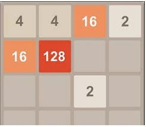
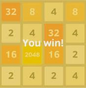

#☺ game-2840

it is fun game created in  python
it is a game build in python3 using Tkinter lib.

...

###It contains 3 files that are as follows:-
>The [constants file](constants.ipynb) contains the constant data that is required for the file and is used for the graphics part.
>The [logicsfinal](logicsfinal.ipynb) file contains the main code or you can say the logic behind the game.
>The [2048](2048.ipynb) file contains the main executable file do import files constants and logicsfinal in this file to run the game.

